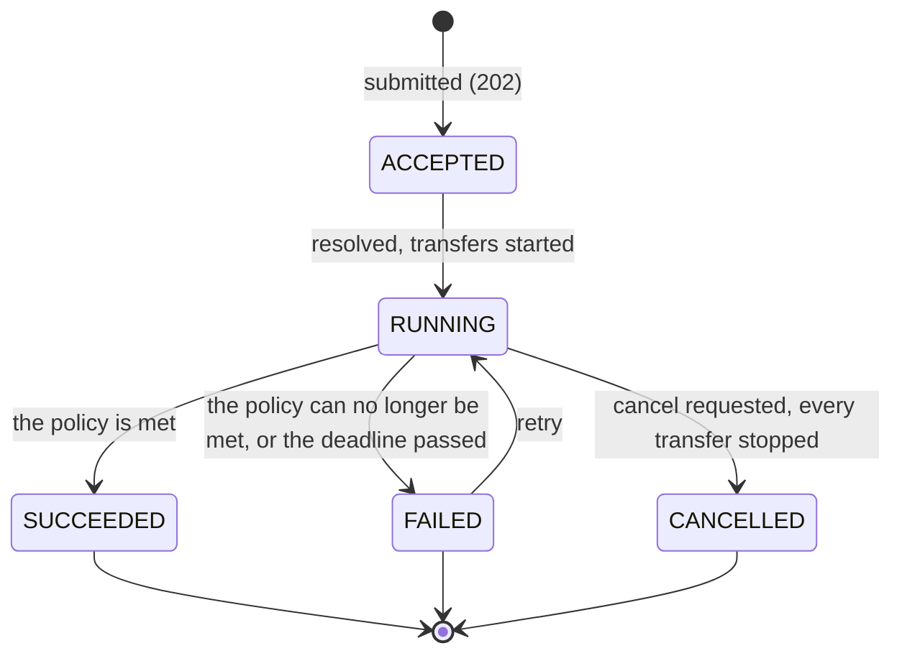

# The states of a job

```mermaid
stateDiagram-v2
  [*] --> ACCEPTED: submitted (202)
  ACCEPTED --> RUNNING: resolved, transfers started
  RUNNING --> SUCCEEDED: the policy is met
  RUNNING --> FAILED: the policy can no longer be met, or the deadline passed
  RUNNING --> CANCELLED: cancel requested, every transfer stopped
  FAILED --> RUNNING: retry
  SUCCEEDED --> [*]
  FAILED --> [*]
  CANCELLED --> [*]
```
