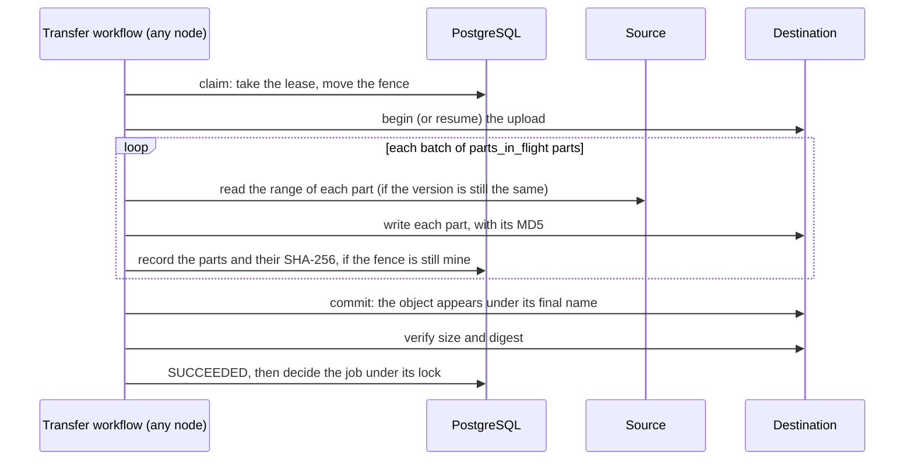

# A transfer, part by part

```mermaid
sequenceDiagram
  participant W as Transfer workflow (any node)
  participant DB as PostgreSQL
  participant S as Source
  participant D as Destination
  W->>DB: claim: take the lease, move the fence
  W->>D: begin (or resume) the upload
  loop each batch of parts_in_flight parts
    W->>S: read the range of each part (if the version is still the same)
    W->>D: write each part, with its MD5
    W->>DB: record the parts and their SHA-256, if the fence is still mine
  end
  W->>D: commit: the object appears under its final name
  W->>D: verify size and digest
  W->>DB: SUCCEEDED, then decide the job under its lock
```
